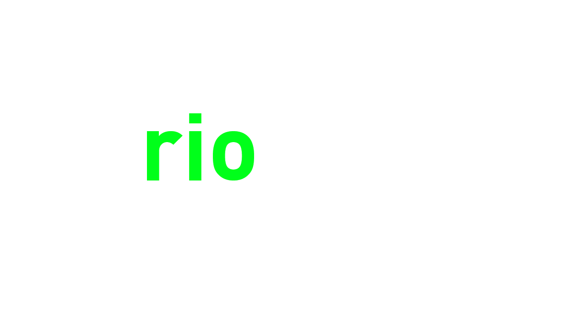

<h3 align="center"></h3>

A command-line roborio information tool written in rust 

***

RioFetch is a coomand line interface used to collect information about the roborio. Riofetch displays a dump of rio information in a visually pleasing way.

The overall purpose of RioFetch is to allow its users to share their teams setup with a personal flair.

**RioFetch is a work in progress and is not currently feature complete**

*if you couldn't tell already RioFetch is heavily inspired by [neofetch](https://github.com/dylanaraps/neofetch)*